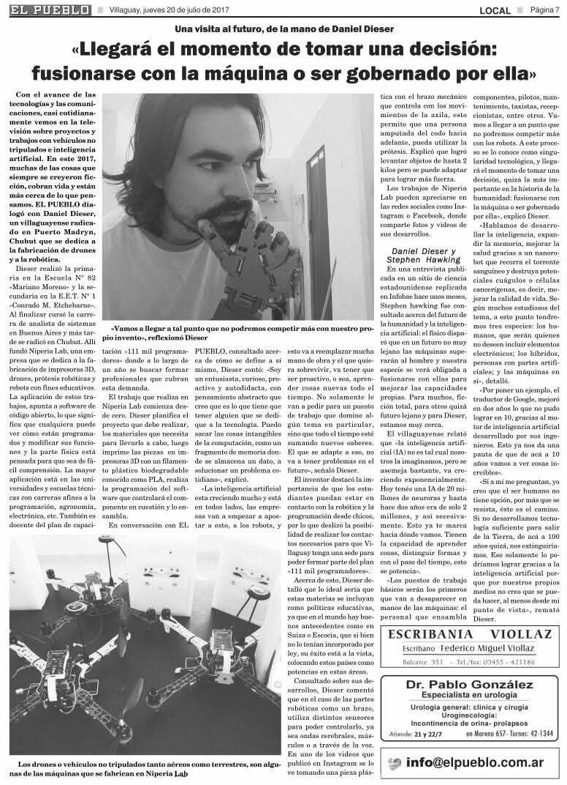

# Chapter 2: La Profecía de Villaguay

## *The Prophecy of Villaguay (2017)*

> *"They called it crazy. Five years later, ChatGPT launched."*

---

## The Interview

In 2017, a local newspaper in **Villaguay, Entre Ríos** — a small town of 50,000 people in the Argentine heartland — published an interview with a local researcher who had been building AI systems.


*"Llegará el momento de tomar una decisión: fusionarse con la máquina... o ser gobernado por ella."*

In that interview, Daniel said things that at the time sounded exaggerated and delirious:

> *"Llegara un momento en que tendremos que tomar una decision: fusionarnos con la maquina... o ser gobernado por ella."*

He talked about artificial intelligence when almost nobody in Argentina was talking about AI. He talked about robots supervising jobs. He talked about how AI was going to surpass humans. He talked about how we couldn't compete with our own invention. And he said it with total certainty.

He described how he built drones, robotic arms, prosthetics controlled by muscle signals, how he 3D-printed parts with machines he himself built, and how he saw technology advancing faster than human capacity to adapt.

He also said another phrase that today seems pulled from 2025:

> *"La inteligencia artificial va a reemplazar mucha mano de obra. El que se adapte no va a tener problemas. El que no... va a quedar afuera."*

And he closed with a vision that is happening before our eyes:

> *"La IA nos va a superar"*

He spoke about the cure of all diseases and the possible end of civilization in 100 years if we don't find the way out. He said AI would help us in the attempt.

In 2017, this was dismissed as science fiction. Neural networks were still a niche topic. AlphaGo had just beaten Lee Sedol, but most people had no idea what that meant.

Today, looking back, many of those ideas weren't predictions: they were the early reading of a wave that was about to come. And now he stands right where that wave exploded. The prophecy wasn't futuristic. It was the beginning of the path he's walking now.

---

## What Happened Next

```
2017  "AI will replace jobs"          → 2023  ChatGPT triggers mass layoffs
2017  "Machines will surpass humans"  → 2024  GPT-4 passes the bar exam
2017  "LATAM needs its own AI"        → 2025  Still importing everything
2017  "We built a Spanish assistant"  → 2025  JarvisIA was 8 years ahead
```

The prophecy wasn't prophecy — it was **observation**. Anyone paying attention to the trajectory of neural networks, GPU compute, and data availability could have made the same predictions.

The difference? **Most people weren't paying attention.**

---

## Why Villaguay Matters

The point isn't that the predictions were correct. The point is **where they came from**.

Not Stanford. Not MIT. Not Google Brain. A small town in Argentina where the nearest tech hub was 400 km away.

This matters because:

1. **Innovation doesn't require geography** — it requires curiosity and persistence
2. **The "expert consensus" is often wrong** — especially about exponential technologies
3. **Building is the best form of prediction** — if you can build it, you understand it deeply enough to see where it's going

---

## The JarvisIA Context

When Daniel made these predictions, he wasn't speculating from theory. He had already built **JarvisIA** — a working voice assistant in Spanish:

- **Wit.ai** for natural language understanding
- **Google Speech API** for voice recognition
- **Telegram integration** for mobile access
- **IoT control** — turning lights on/off, reading sensors
- **Raspberry Pi deployment** — running on a $35 computer

```python
# JarvisIA (2015) — Before Alexa spoke Spanish
# This was running on a Raspberry Pi in Puerto Madryn
# while the rest of the world waited for Siri to learn Spanish

async def process_voice(audio):
    text = await speech_to_text(audio)           # Google Speech
    intent = await understand(text)               # Wit.ai NLP
    response = await execute_action(intent)       # IoT / Search / Chat
    await text_to_speech(response)                # Speak back
```

When you've built a working AI system from scratch, predictions about AI's future aren't speculation — they're extrapolation.

---

## The Lesson for Builders

> **"Don't wait for permission. Don't wait for the 'right' location. Don't wait for the experts to agree. Build it, deploy it, learn from it. The experts will catch up."**

Every chapter of this book follows this philosophy: understanding comes from building, not from reading about building.

---

*Next: [Chapter 3 — Redes Neuronales como nunca te las explicaron →](../papers/neural-networks-2018.md)*
